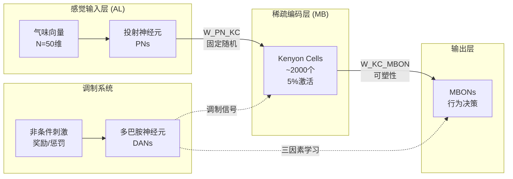
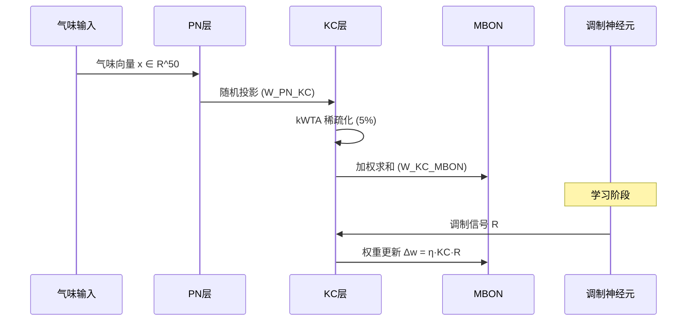

# Design Document: Drosophila Olfactory Model

## Overview

本设计文档描述果蝇嗅觉系统计算模型的技术架构和实现细节。该模型模拟从触角叶（AL）到蘑菇体（MB）再到输出神经元（MBONs）的三层前馈网络，并通过调制神经元（DANs）实现联想学习。

核心设计目标：
- 实现生物学上合理的稀疏编码机制
- 支持基于三因素学习律的突触可塑性
- 提供高效的单次学习（One-shot Learning）能力
- 确保模式分离和泛化能力

## Architecture



### 信号流



## Components and Interfaces

### 1. OdorDataset 类

负责生成和管理气味数据集。

```python
class OdorDataset:
    """气味数据集生成器"""
    
    def __init__(self, n_features: int = 50)
    
    def generate_prototype(self, name: str) -> np.ndarray
        """生成气味原型向量"""
    
    def generate_variants(self, prototype: np.ndarray, 
                          n_samples: int, 
                          noise_level: float) -> np.ndarray
        """生成带噪声的变体样本"""
    
    def generate_concentration_variants(self, prototype: np.ndarray,
                                         concentration_factors: List[float]) -> np.ndarray
        """生成不同浓度的变体"""
    
    def create_dataset(self, prototypes: Dict[str, np.ndarray],
                       n_samples_per_odor: int,
                       noise_level: float) -> Tuple[np.ndarray, np.ndarray]
        """创建完整数据集"""
    
    def to_json(self) -> str
        """序列化为 JSON"""
    
    @classmethod
    def from_json(cls, json_str: str) -> 'OdorDataset'
        """从 JSON 反序列化"""
```

### 2. SparseEncoder 类

实现 KC 层的稀疏编码机制。

```python
class SparseEncoder:
    """稀疏编码器 (KC层)"""
    
    def __init__(self, n_input: int, n_output: int, 
                 sparsity: float = 0.05,
                 connectivity: float = 0.14)
    
    def _initialize_weights(self) -> np.ndarray
        """初始化稀疏随机连接矩阵"""
    
    def encode(self, input_vector: np.ndarray) -> np.ndarray
        """执行稀疏编码 (kWTA)"""
    
    def get_active_indices(self, input_vector: np.ndarray) -> np.ndarray
        """获取激活的 KC 索引"""
```

### 3. DrosophilaOlfactoryModel 类

主模型类，整合所有组件。

```python
class DrosophilaOlfactoryModel:
    """果蝇嗅觉系统模型"""
    
    def __init__(self, n_pn: int = 50, 
                 n_kc: int = 2000, 
                 n_mbon: int = 1,
                 sparsity: float = 0.05,
                 learning_rate: float = 0.05)
    
    @property
    def weights_kc_mbon(self) -> np.ndarray
        """获取 KC-MBON 权重矩阵"""
    
    def predict(self, odor_input: np.ndarray) -> Tuple[np.ndarray, np.ndarray]
        """预测 MBON 输出，返回 (output, kc_activation)"""
    
    def modulate(self, kc_active: np.ndarray, 
                 modulatory_signal: float) -> None
        """应用调制信号更新权重"""
    
    def train_aversive(self, odor: np.ndarray, 
                       strength: float = 1.0) -> float
        """执行厌恶学习训练，返回权重变化量"""
    
    def train_appetitive(self, odor: np.ndarray,
                         strength: float = 1.0) -> float
        """执行奖励学习训练，返回权重变化量"""
    
    def reset_weights(self) -> None
        """重置 KC-MBON 权重到初始状态"""
    
    def to_json(self) -> str
        """序列化模型状态"""
    
    @classmethod
    def from_json(cls, json_str: str) -> 'DrosophilaOlfactoryModel'
        """从 JSON 恢复模型"""
```

### 4. ModelEvaluator 类

模型评估工具。

```python
class ModelEvaluator:
    """模型评估器"""
    
    def __init__(self, model: DrosophilaOlfactoryModel)
    
    def compute_discrimination_index(self, 
                                      response_before: float,
                                      response_after: float) -> float
        """计算区分指数"""
    
    def compute_pattern_separation(self,
                                    odor_a: np.ndarray,
                                    odor_b: np.ndarray) -> Dict[str, float]
        """计算模式分离效果"""
    
    def evaluate_generalization(self,
                                trained_odor: np.ndarray,
                                test_variants: np.ndarray) -> np.ndarray
        """评估泛化能力"""
    
    def evaluate_specificity(self,
                             trained_odor: np.ndarray,
                             untrained_odors: List[np.ndarray]) -> Dict[str, float]
        """评估学习特异性"""
```

## Data Models

### 气味向量

```python
OdorVector = np.ndarray  # shape: (n_features,), dtype: float64, range: [0, 1]
```

### KC 激活模式

```python
KCActivation = np.ndarray  # shape: (n_kc,), dtype: float64, values: {0.0, 1.0}
```

### 权重矩阵

```python
# PN -> KC 连接矩阵 (固定)
W_PN_KC = np.ndarray  # shape: (n_pn, n_kc), dtype: bool, sparse

# KC -> MBON 连接矩阵 (可塑)
W_KC_MBON = np.ndarray  # shape: (n_kc, n_mbon), dtype: float64, range: [0, 1]
```

### 模型状态 JSON Schema

```json
{
  "type": "object",
  "properties": {
    "n_pn": {"type": "integer"},
    "n_kc": {"type": "integer"},
    "n_mbon": {"type": "integer"},
    "sparsity": {"type": "number"},
    "learning_rate": {"type": "number"},
    "W_pn_kc": {"type": "array", "items": {"type": "array", "items": {"type": "boolean"}}},
    "W_kc_mbon": {"type": "array", "items": {"type": "array", "items": {"type": "number"}}}
  },
  "required": ["n_pn", "n_kc", "n_mbon", "sparsity", "learning_rate", "W_pn_kc", "W_kc_mbon"]
}
```

### 数据集 JSON Schema

```json
{
  "type": "object",
  "properties": {
    "n_features": {"type": "integer"},
    "prototypes": {
      "type": "object",
      "additionalProperties": {"type": "array", "items": {"type": "number"}}
    },
    "samples": {"type": "array", "items": {"type": "array", "items": {"type": "number"}}},
    "labels": {"type": "array", "items": {"type": "string"}}
  }
}
```


## Correctness Properties

*A property is a characteristic or behavior that should hold true across all valid executions of a system-essentially, a formal statement about what the system should do. Properties serve as the bridge between human-readable specifications and machine-verifiable correctness guarantees.*

### Property 1: Odor Vector Range Invariant

*For any* generated odor prototype or variant vector, all elements SHALL be within the range [0, 1].

**Validates: Requirements 1.2**

### Property 2: KC Sparsity Invariant

*For any* odor input vector, the KC layer activation SHALL have exactly k active neurons, where k = floor(n_kc × sparsity), representing approximately 5% of total KCs.

**Validates: Requirements 2.2**

### Property 3: Pattern Separation

*For any* pair of similar odor vectors with input overlap > 80%, the Euclidean distance between their KC layer representations SHALL be greater than the Euclidean distance between the original input vectors.

**Validates: Requirements 2.3**

### Property 4: MBON Output Computation

*For any* KC activation pattern and weight matrix, the MBON output SHALL equal the dot product of the KC activation vector and the corresponding column of W_KC_MBON.

**Validates: Requirements 3.1**

### Property 5: Weight Bounds Invariant

*For any* sequence of weight updates (regardless of modulation signal magnitude or sign), all weights in W_KC_MBON SHALL remain within the range [0, 1].

**Validates: Requirements 3.5**

### Property 6: Three-Factor Learning Rule

*For any* learning update with KC activation pattern kc, modulatory signal R, and learning rate η, the weight change for active KCs SHALL be proportional to η × R, and weights for inactive KCs SHALL remain unchanged.

**Validates: Requirements 4.1, 4.4, 4.5**

### Property 7: Aversive Learning Causes LTD

*For any* odor input paired with a positive modulatory signal (aversive stimulus), the weights corresponding to active KCs SHALL decrease (or remain at 0 if already at minimum).

**Validates: Requirements 4.2**

### Property 8: Appetitive Learning Causes LTP

*For any* odor input paired with a negative modulatory signal (appetitive stimulus), the weights corresponding to active KCs SHALL increase (or remain at 1 if already at maximum).

**Validates: Requirements 4.3**

### Property 9: Learning Reduces Trained Odor Response

*For any* odor that undergoes aversive training, the MBON output after training SHALL be less than the MBON output before training.

**Validates: Requirements 5.2, 5.4**

### Property 10: Learning Specificity

*For any* odor that was NOT used in training, the MBON output after training another odor SHALL remain within a small tolerance (< 5%) of its pre-training value.

**Validates: Requirements 5.3**

### Property 11: Model Serialization Round-Trip

*For any* valid DrosophilaOlfactoryModel instance, serializing to JSON and then deserializing SHALL produce a model with identical parameters and weight matrices.

**Validates: Requirements 7.1, 7.2, 7.5**

### Property 12: Dataset Serialization Round-Trip

*For any* valid OdorDataset instance, serializing to JSON and then deserializing SHALL produce a dataset with identical prototypes, samples, and labels.

**Validates: Requirements 7.3, 7.4, 7.5**

## Error Handling

### Input Validation

| Error Condition | Handling Strategy |
|-----------------|-------------------|
| Odor vector dimension mismatch | Raise `ValueError` with expected vs actual dimensions |
| Odor vector values outside [0, 1] | Clip values and log warning |
| Invalid sparsity parameter (not in (0, 1)) | Raise `ValueError` |
| Invalid learning rate (negative) | Raise `ValueError` |
| Empty odor dataset | Raise `ValueError` |

### Numerical Stability

- Weight clipping to [0, 1] prevents unbounded growth
- Use `np.clip` for all bounded operations
- Handle division by zero in normalization with small epsilon

### Serialization Errors

| Error Condition | Handling Strategy |
|-----------------|-------------------|
| Invalid JSON format | Raise `json.JSONDecodeError` with context |
| Missing required fields | Raise `KeyError` with field name |
| Type mismatch in deserialization | Raise `TypeError` with expected type |

## Testing Strategy

### Property-Based Testing Framework

本项目使用 **Hypothesis** 作为属性测试框架（Python 生态系统中最成熟的 PBT 库）。

```python
from hypothesis import given, strategies as st, settings
```

### Test Configuration

- 每个属性测试运行最少 **100 次迭代**
- 使用 `@settings(max_examples=100)` 配置
- 测试文件命名：`test_<module>_properties.py`

### Property Test Annotations

每个属性测试必须包含以下格式的注释：

```python
# **Feature: drosophila-olfactory-model, Property 1: Odor Vector Range Invariant**
# **Validates: Requirements 1.2**
```

### Test Categories

#### 1. Unit Tests

- 验证各组件的基本功能
- 测试边界条件和错误处理
- 文件：`test_odor_dataset.py`, `test_sparse_encoder.py`, `test_model.py`

#### 2. Property-Based Tests

| Property | Test Strategy | Generator |
|----------|---------------|-----------|
| P1: Odor Range | Generate random vectors, verify bounds | `st.floats(0, 1)` arrays |
| P2: KC Sparsity | Generate random odors, count active KCs | Random odor vectors |
| P3: Pattern Separation | Generate similar odor pairs, compare distances | Pairs with controlled overlap |
| P4: MBON Computation | Generate KC patterns and weights, verify dot product | Random binary vectors and weight matrices |
| P5: Weight Bounds | Apply random modulation sequences, verify bounds | Random modulation signals |
| P6: Three-Factor Rule | Verify update formula with random inputs | Random KC, R, η combinations |
| P7: LTD | Apply positive modulation, verify weight decrease | Random odors with positive R |
| P8: LTP | Apply negative modulation, verify weight increase | Random odors with negative R |
| P9: Learning Effect | Train and test same odor, verify decrease | Random odors |
| P10: Specificity | Train one odor, test another, verify stability | Pairs of distinct odors |
| P11: Model Round-Trip | Serialize/deserialize, compare | Random model configurations |
| P12: Dataset Round-Trip | Serialize/deserialize, compare | Random datasets |

### Custom Generators

```python
@st.composite
def odor_vectors(draw, n_features=50):
    """Generate valid odor vectors"""
    return draw(st.lists(
        st.floats(min_value=0.0, max_value=1.0),
        min_size=n_features, max_size=n_features
    ).map(np.array))

@st.composite
def similar_odor_pairs(draw, n_features=50, min_overlap=0.8):
    """Generate pairs of similar odors with controlled overlap"""
    base = draw(odor_vectors(n_features))
    noise_mask = draw(st.lists(
        st.booleans(),
        min_size=n_features, max_size=n_features
    ))
    # Ensure at least min_overlap similarity
    n_changed = int(n_features * (1 - min_overlap))
    variant = base.copy()
    indices = np.where(noise_mask)[0][:n_changed]
    variant[indices] = draw(st.floats(0, 1))
    return base, np.clip(variant, 0, 1)

@st.composite
def model_configs(draw):
    """Generate valid model configurations"""
    return {
        'n_pn': draw(st.integers(10, 100)),
        'n_kc': draw(st.integers(100, 500)),
        'n_mbon': draw(st.integers(1, 5)),
        'sparsity': draw(st.floats(0.01, 0.2)),
        'learning_rate': draw(st.floats(0.001, 0.5))
    }
```

### Integration Tests

- 完整训练流程测试
- 多气味学习场景
- 泛化能力评估

### Test File Structure

```
tests/
├── __init__.py
├── conftest.py              # Shared fixtures and generators
├── test_odor_dataset.py     # Unit tests for OdorDataset
├── test_sparse_encoder.py   # Unit tests for SparseEncoder
├── test_model.py            # Unit tests for main model
├── test_evaluator.py        # Unit tests for ModelEvaluator
├── test_properties.py       # All property-based tests
└── test_integration.py      # Integration tests
```
