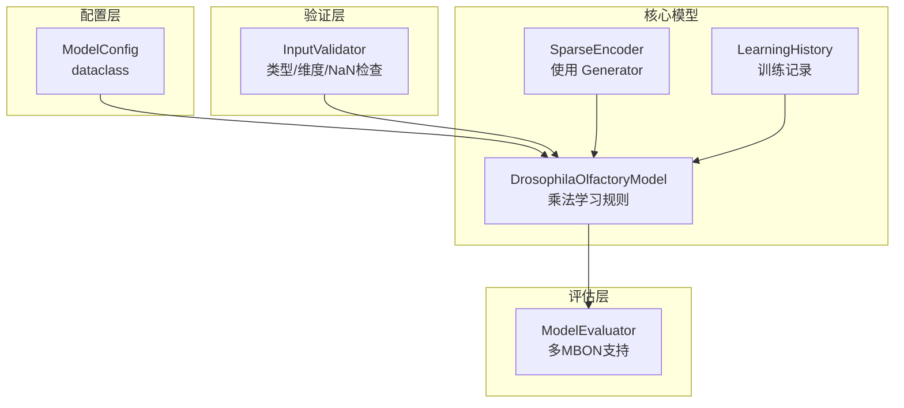
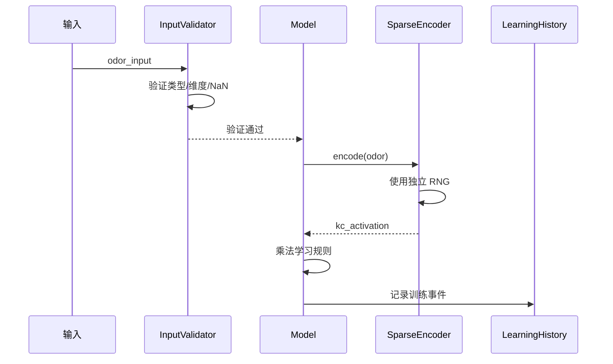

# Design Document: Model Improvements

## Overview

本设计文档描述对果蝇嗅觉系统模型的改进方案，解决已识别的关键缺陷和设计问题。改进目标包括：

1. **正确性**: 修复权重恢复和随机状态管理问题
2. **生物学合理性**: 使用乘法学习规则
3. **健壮性**: 增强输入验证和错误处理
4. **可追溯性**: 添加学习历史记录
5. **可配置性**: 引入配置管理系统
6. **扩展性**: 完善多 MBON 支持

## Architecture



### 改进后的数据流



## Components and Interfaces

### 1. ModelConfig 类 (新增)

配置管理数据类。

```python
from dataclasses import dataclass
from typing import Optional

@dataclass
class ModelConfig:
    """模型配置参数"""
    n_pn: int = 50
    n_kc: int = 2000
    n_mbon: int = 1
    sparsity: float = 0.05
    learning_rate: float = 0.05
    connectivity: float = 0.14
    seed: Optional[int] = None
    
    def validate(self) -> None:
        """验证配置参数有效性"""
        if self.n_pn <= 0:
            raise ValueError(f"n_pn must be positive, got {self.n_pn}")
        if self.n_kc <= 0:
            raise ValueError(f"n_kc must be positive, got {self.n_kc}")
        if self.n_mbon <= 0:
            raise ValueError(f"n_mbon must be positive, got {self.n_mbon}")
        if not (0 < self.sparsity < 1):
            raise ValueError(f"sparsity must be in (0, 1), got {self.sparsity}")
        if self.learning_rate < 0:
            raise ValueError(f"learning_rate must be non-negative, got {self.learning_rate}")
        if not (0 < self.connectivity <= 1):
            raise ValueError(f"connectivity must be in (0, 1], got {self.connectivity}")
```

### 2. SparseEncoder 改进

使用独立随机数生成器。

```python
from numpy.random import Generator, PCG64

class SparseEncoder:
    def __init__(self, ..., seed: Optional[int] = None):
        # 使用独立的随机数生成器
        if seed is not None:
            self._rng = Generator(PCG64(seed))
        else:
            self._rng = np.random.default_rng()
        
        self._weights = self._initialize_weights()
    
    def _initialize_weights(self) -> np.ndarray:
        """使用独立 RNG 初始化权重"""
        weights = np.zeros((self.n_input, self.n_output), dtype=np.float64)
        
        for kc_idx in range(self.n_output):
            n_connections = max(1, int(np.round(self.connectivity * self.n_input)))
            # 使用实例 RNG 而非全局状态
            connected_pns = self._rng.choice(
                self.n_input, 
                size=n_connections, 
                replace=False
            )
            weights[connected_pns, kc_idx] = 1.0
        
        return weights
```

### 3. 输入验证方法

添加到 DrosophilaOlfactoryModel。

```python
def _validate_input(self, odor_input: np.ndarray, name: str = "odor") -> None:
    """验证输入向量"""
    if not isinstance(odor_input, np.ndarray):
        raise TypeError(f"{name} must be np.ndarray, got {type(odor_input).__name__}")
    
    if odor_input.ndim != 1:
        raise ValueError(f"{name} must be 1D, got shape {odor_input.shape}")
    
    if odor_input.shape[0] != self.n_pn:
        raise ValueError(
            f"{name} dimension mismatch: expected {self.n_pn}, got {odor_input.shape[0]}"
        )
    
    if np.isnan(odor_input).any():
        raise ValueError(f"{name} contains NaN values")
    
    if np.isinf(odor_input).any():
        raise ValueError(f"{name} contains Inf values")
```

### 4. 乘法学习规则

改进 modulate 方法。

```python
def modulate(self, kc_active: np.ndarray, modulatory_signal: float) -> None:
    """
    使用乘法学习规则更新权重。
    
    LTD (R > 0): w = w × (1 - η × R)
    LTP (R < 0): w = w + η × |R| × (1 - w)
    """
    active_mask = kc_active.reshape(-1, 1) > 0
    
    if modulatory_signal > 0:  # Aversive (LTD)
        # 乘法规则: 权重按比例减少
        decay_factor = 1 - self.learning_rate * modulatory_signal
        self._W_kc_mbon = np.where(
            active_mask,
            self._W_kc_mbon * decay_factor,
            self._W_kc_mbon
        )
    else:  # Appetitive (LTP)
        # 乘法规则: 权重向1增长，增长速度随接近1而减缓
        growth = self.learning_rate * abs(modulatory_signal) * (1 - self._W_kc_mbon)
        self._W_kc_mbon = np.where(
            active_mask,
            self._W_kc_mbon + growth,
            self._W_kc_mbon
        )
    
    # 确保权重在 [0, 1] 范围内
    self._W_kc_mbon = np.clip(self._W_kc_mbon, 0.0, 1.0)
```

### 5. 学习历史记录

添加到 DrosophilaOlfactoryModel。

```python
from typing import TypedDict, List

class LearningEvent(TypedDict):
    type: str  # 'aversive' or 'appetitive'
    odor_hash: int
    strength: float
    weight_change: float
    timestamp: float

class DrosophilaOlfactoryModel:
    def __init__(self, ...):
        # ... existing code ...
        self._learning_history: List[LearningEvent] = []
    
    def train_aversive(self, odor: np.ndarray, strength: float = 1.0) -> float:
        # ... existing training code ...
        
        # 记录训练事件
        import time
        self._learning_history.append({
            'type': 'aversive',
            'odor_hash': hash(odor.tobytes()),
            'strength': strength,
            'weight_change': weight_change,
            'timestamp': time.time()
        })
        
        return weight_change
    
    def get_learning_history(self) -> List[LearningEvent]:
        """返回学习历史记录"""
        return self._learning_history.copy()
    
    def reset_weights(self, clear_history: bool = False) -> None:
        """重置权重，可选清除历史"""
        self._W_kc_mbon = self._W_kc_mbon_initial.copy()
        if clear_history:
            self._learning_history = []
```

### 6. 改进的序列化

```python
def to_json(self) -> str:
    """序列化模型状态，包含完整信息"""
    data = {
        "n_pn": self.n_pn,
        "n_kc": self.n_kc,
        "n_mbon": self.n_mbon,
        "sparsity": self.sparsity,
        "learning_rate": self.learning_rate,
        "connectivity": self.connectivity,
        "seed": self._seed,  # 新增
        "W_pn_kc": self._encoder.weights.tolist(),
        "W_kc_mbon": self._W_kc_mbon.tolist(),
        "learning_history": self._learning_history  # 新增
    }
    return json.dumps(data, indent=2)

@classmethod
def from_json(cls, json_str: str) -> 'DrosophilaOlfactoryModel':
    """从 JSON 恢复模型，包含验证"""
    data = json.loads(json_str)
    
    # 验证必需字段
    required_fields = ["n_pn", "n_kc", "n_mbon", "sparsity", 
                       "learning_rate", "W_pn_kc", "W_kc_mbon"]
    for field in required_fields:
        if field not in data:
            raise KeyError(f"Missing required field: {field}")
    
    # 验证权重矩阵维度
    W_pn_kc = np.array(data["W_pn_kc"], dtype=np.float64)
    W_kc_mbon = np.array(data["W_kc_mbon"], dtype=np.float64)
    
    if W_pn_kc.shape != (data["n_pn"], data["n_kc"]):
        raise ValueError(
            f"W_pn_kc shape {W_pn_kc.shape} doesn't match "
            f"expected ({data['n_pn']}, {data['n_kc']})"
        )
    
    if W_kc_mbon.shape != (data["n_kc"], data["n_mbon"]):
        raise ValueError(
            f"W_kc_mbon shape {W_kc_mbon.shape} doesn't match "
            f"expected ({data['n_kc']}, {data['n_mbon']})"
        )
    
    # 创建模型
    model = cls(
        n_pn=data["n_pn"],
        n_kc=data["n_kc"],
        n_mbon=data["n_mbon"],
        sparsity=data["sparsity"],
        learning_rate=data["learning_rate"],
        connectivity=data.get("connectivity", 0.14),
        seed=data.get("seed", None)
    )
    
    # 恢复权重
    model._encoder._weights = W_pn_kc
    model._W_kc_mbon = W_kc_mbon
    model._W_kc_mbon_initial = W_kc_mbon.copy()
    
    # 恢复学习历史
    model._learning_history = data.get("learning_history", [])
    
    return model
```

### 7. 多 MBON 支持改进

改进 ModelEvaluator。

```python
class ModelEvaluator:
    def compute_discrimination_index(
        self, 
        response_before: np.ndarray,
        response_after: np.ndarray,
        mbon_idx: int = 0
    ) -> float:
        """
        计算指定 MBON 的区分指数。
        
        Args:
            response_before: 训练前 MBON 输出，shape (n_mbon,)
            response_after: 训练后 MBON 输出，shape (n_mbon,)
            mbon_idx: 要计算的 MBON 索引
        """
        if mbon_idx >= len(response_before):
            raise ValueError(
                f"mbon_idx {mbon_idx} out of range for {len(response_before)} MBONs"
            )
        
        before = response_before[mbon_idx]
        after = response_after[mbon_idx]
        
        if before == 0:
            raise ValueError("response_before cannot be zero")
        
        return (before - after) / before
    
    def evaluate_generalization(
        self, 
        trained_odor: np.ndarray, 
        test_variants: np.ndarray
    ) -> np.ndarray:
        """
        评估泛化能力，返回所有 MBON 的响应。
        
        Returns:
            np.ndarray: shape (n_variants, n_mbon)
        """
        if test_variants.ndim == 1:
            test_variants = test_variants.reshape(1, -1)
        
        responses = []
        for variant in test_variants:
            output, _ = self.model.predict(variant)
            responses.append(output)  # 保留所有 MBON
        
        return np.array(responses)
```

## Data Models

### ModelConfig Schema

```python
@dataclass
class ModelConfig:
    n_pn: int          # 投射神经元数量
    n_kc: int          # Kenyon 细胞数量
    n_mbon: int        # 输出神经元数量
    sparsity: float    # KC 层稀疏度
    learning_rate: float  # 学习率
    connectivity: float   # PN-KC 连接率
    seed: Optional[int]   # 随机种子
```

### LearningEvent Schema

```python
class LearningEvent(TypedDict):
    type: str           # 'aversive' | 'appetitive'
    odor_hash: int      # 气味向量哈希
    strength: float     # 刺激强度
    weight_change: float  # 权重变化量
    timestamp: float    # 时间戳
```

### 更新的 JSON Schema

```json
{
  "type": "object",
  "properties": {
    "n_pn": {"type": "integer"},
    "n_kc": {"type": "integer"},
    "n_mbon": {"type": "integer"},
    "sparsity": {"type": "number"},
    "learning_rate": {"type": "number"},
    "connectivity": {"type": "number"},
    "seed": {"type": ["integer", "null"]},
    "W_pn_kc": {"type": "array"},
    "W_kc_mbon": {"type": "array"},
    "learning_history": {"type": "array"}
  },
  "required": ["n_pn", "n_kc", "n_mbon", "sparsity", "learning_rate", "W_pn_kc", "W_kc_mbon"]
}
```

## Correctness Properties

*A property is a characteristic or behavior that should hold true across all valid executions of a system-essentially, a formal statement about what the system should do. Properties serve as the bridge between human-readable specifications and machine-verifiable correctness guarantees.*

### Property 1: Weight Matrix Dimension Validation

*For any* JSON model state with mismatched weight matrix dimensions (W_pn_kc shape ≠ (n_pn, n_kc) or W_kc_mbon shape ≠ (n_kc, n_mbon)), deserialization SHALL raise a ValueError.

**Validates: Requirements 1.1, 1.2, 6.4**

### Property 2: Seed Serialization Completeness

*For any* model initialized with a seed value, the serialized JSON SHALL contain the seed field with the original value.

**Validates: Requirements 1.3, 6.1**

### Property 3: Initial Weights Restoration

*For any* model restored from JSON, the W_kc_mbon_initial SHALL equal a copy of the restored W_kc_mbon.

**Validates: Requirements 1.4**

### Property 4: Random State Isolation

*For any* two SparseEncoder instances created with different seeds, their weight matrices SHALL be different (with probability > 0.99999).

**Validates: Requirements 2.1, 2.4**

### Property 5: Seed Reproducibility

*For any* seed value, two SparseEncoder instances created with the same seed SHALL produce identical weight matrices.

**Validates: Requirements 2.2**

### Property 6: Multiplicative LTD Rule

*For any* aversive learning update with modulatory signal R > 0, the new weight for active KCs SHALL equal w_old × (1 - η × R), clipped to [0, 1].

**Validates: Requirements 3.1**

### Property 7: Multiplicative LTP Rule

*For any* appetitive learning update with modulatory signal R < 0, the new weight for active KCs SHALL equal w_old + η × |R| × (1 - w_old), clipped to [0, 1].

**Validates: Requirements 3.2**

### Property 8: Boundary Update Deceleration

*For any* weight close to boundary (w < 0.1 or w > 0.9), the absolute weight change from multiplicative update SHALL be smaller than for weights at 0.5.

**Validates: Requirements 3.4**

### Property 9: NaN/Inf Input Rejection

*For any* input array containing NaN or Inf values, the predict method SHALL raise a ValueError.

**Validates: Requirements 4.4**

### Property 10: Learning History Completeness

*For any* sequence of N training operations, the learning history SHALL contain exactly N events with correct type, strength, and non-zero weight_change for each.

**Validates: Requirements 5.2, 5.3**

### Property 11: Config Validation

*For any* ModelConfig with invalid parameters (n_pn ≤ 0, sparsity ∉ (0,1), etc.), the validate() method SHALL raise a ValueError.

**Validates: Requirements 7.2, 7.3**

### Property 12: Config Application

*For any* valid ModelConfig, a model created from it SHALL have all parameters matching the config values.

**Validates: Requirements 7.4**

### Property 13: Multi-MBON Weight Shape

*For any* model with n_mbon > 1, the W_kc_mbon matrix SHALL have shape (n_kc, n_mbon).

**Validates: Requirements 8.1**

### Property 14: Multi-MBON Generalization Response

*For any* model with n_mbon MBONs, evaluate_generalization SHALL return responses with shape (n_variants, n_mbon).

**Validates: Requirements 8.4**

## Error Handling

### 新增错误类型

| Error Condition | Exception Type | Message Format |
|-----------------|----------------|----------------|
| 输入非 ndarray | TypeError | "{name} must be np.ndarray, got {type}" |
| 输入非一维 | ValueError | "{name} must be 1D, got shape {shape}" |
| 输入含 NaN | ValueError | "{name} contains NaN values" |
| 输入含 Inf | ValueError | "{name} contains Inf values" |
| 权重维度不匹配 | ValueError | "W_pn_kc shape {shape} doesn't match expected {expected}" |
| MBON 索引越界 | ValueError | "mbon_idx {idx} out of range for {n} MBONs" |
| 配置参数无效 | ValueError | "{param} must be {constraint}, got {value}" |

## Testing Strategy

### Property-Based Testing Framework

继续使用 **Hypothesis** 作为属性测试框架。

### Test Configuration

- 每个属性测试运行最少 **100 次迭代**
- 使用 `@settings(max_examples=100)` 配置

### Property Test Annotations

每个属性测试必须包含以下格式的注释：

```python
# **Feature: model-improvements, Property N: Property Name**
# **Validates: Requirements X.Y**
```

### 新增测试生成器

```python
@st.composite
def model_configs(draw):
    """生成有效的模型配置"""
    return ModelConfig(
        n_pn=draw(st.integers(10, 100)),
        n_kc=draw(st.integers(100, 500)),
        n_mbon=draw(st.integers(1, 5)),
        sparsity=draw(st.floats(0.01, 0.2)),
        learning_rate=draw(st.floats(0.001, 0.5)),
        connectivity=draw(st.floats(0.05, 0.5)),
        seed=draw(st.one_of(st.none(), st.integers(0, 2**32-1)))
    )

@st.composite
def invalid_model_configs(draw):
    """生成无效的模型配置用于测试验证"""
    invalid_type = draw(st.sampled_from(['n_pn', 'sparsity', 'learning_rate']))
    config = ModelConfig()
    if invalid_type == 'n_pn':
        config.n_pn = draw(st.integers(-100, 0))
    elif invalid_type == 'sparsity':
        config.sparsity = draw(st.one_of(
            st.floats(-1, 0),
            st.floats(1, 2)
        ))
    elif invalid_type == 'learning_rate':
        config.learning_rate = draw(st.floats(-1, -0.001))
    return config

@st.composite
def arrays_with_nan_or_inf(draw, size=50):
    """生成包含 NaN 或 Inf 的数组"""
    arr = draw(st.lists(
        st.floats(0, 1),
        min_size=size, max_size=size
    ).map(np.array))
    
    # 随机插入 NaN 或 Inf
    bad_idx = draw(st.integers(0, size-1))
    bad_value = draw(st.sampled_from([np.nan, np.inf, -np.inf]))
    arr[bad_idx] = bad_value
    return arr
```

### Test File Structure

```
tests/
├── conftest.py                    # 共享 fixtures 和生成器
├── test_properties.py             # 原有属性测试
├── test_improvements.py           # 新增改进相关属性测试
├── test_config.py                 # ModelConfig 测试
├── test_input_validation.py       # 输入验证测试
└── test_learning_history.py       # 学习历史测试
```
