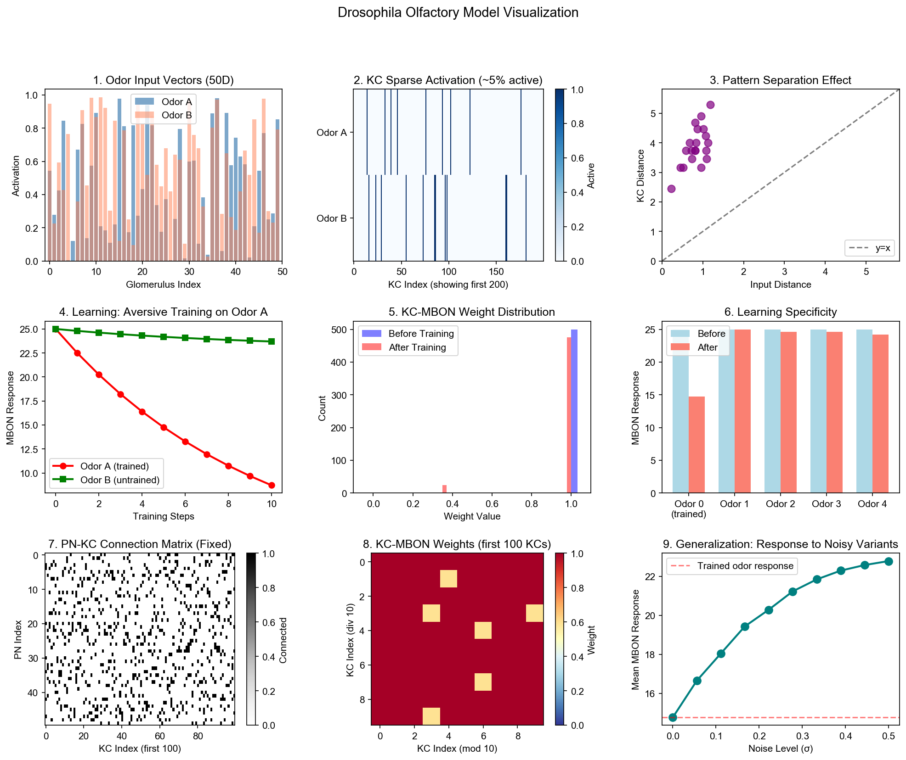
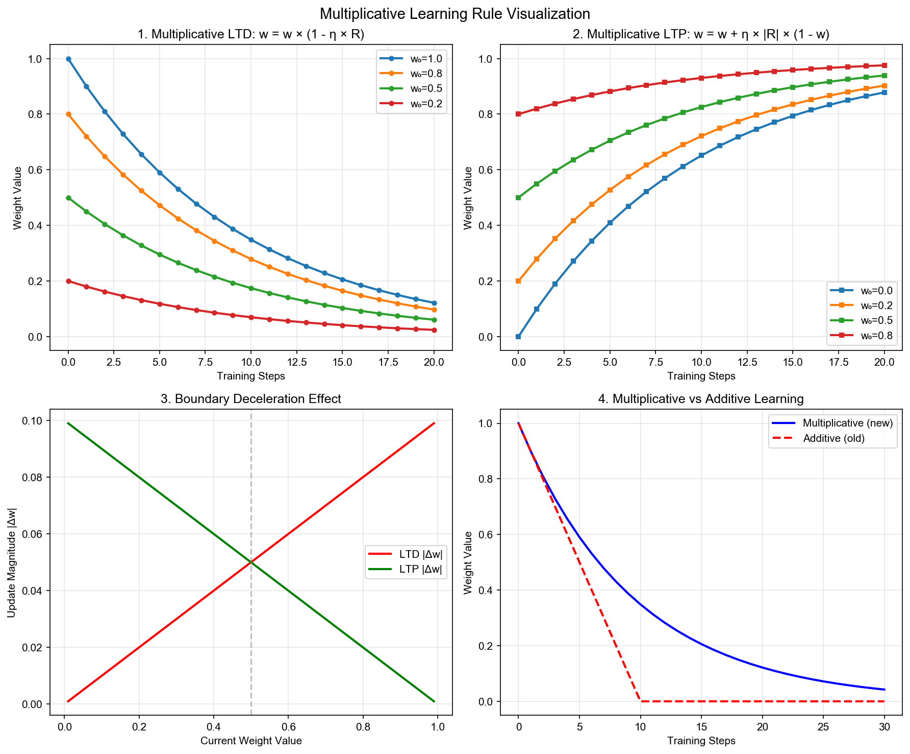
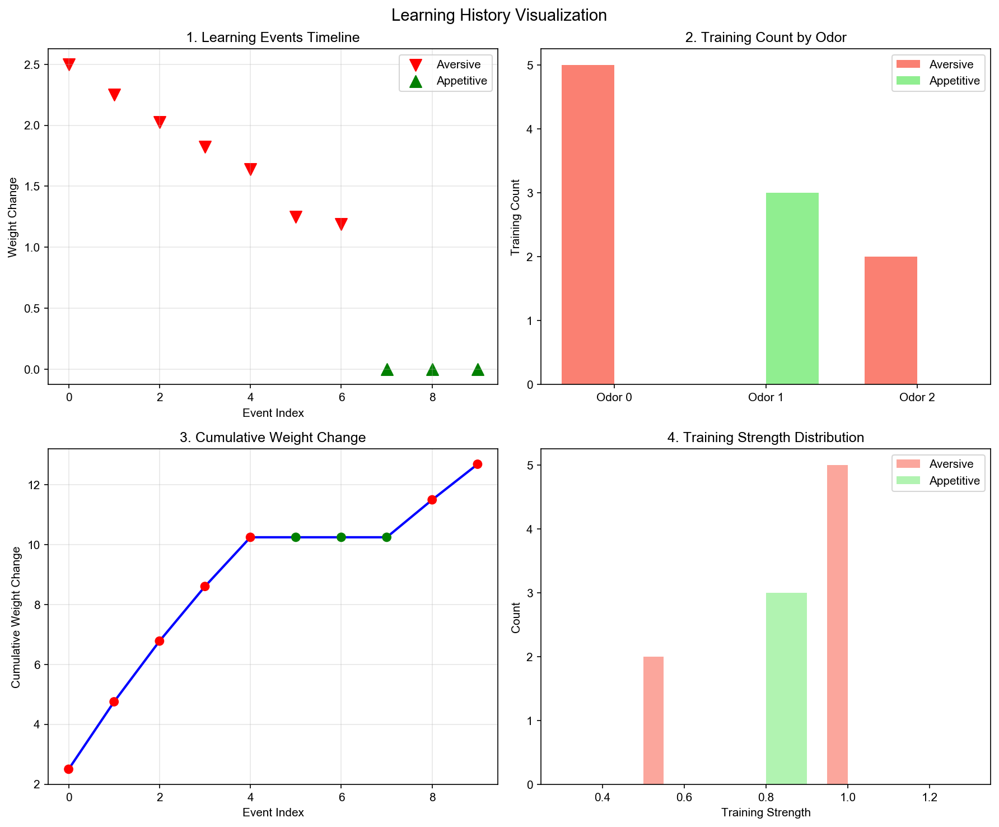
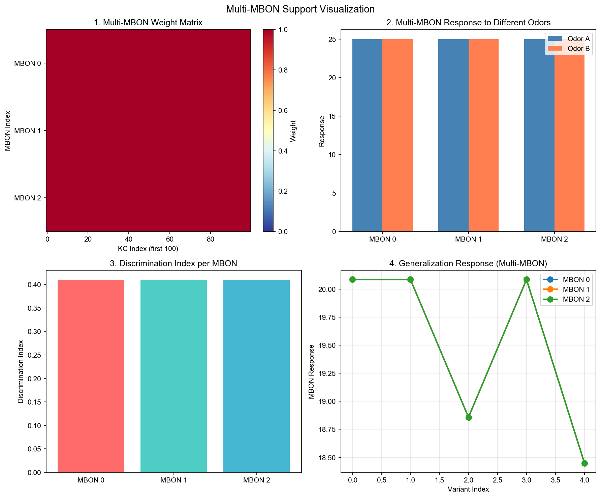

# 果蝇嗅觉系统计算模型 (Drosophila Olfactory System Model)

一个基于生物学原理的果蝇嗅觉神经回路计算模型，模拟从感知信息编码到行为决策输出的完整神经回路。

Group members： Yibo Yu, Yuyuan Lu, Jiahao Tang, Zhouhang Tao

## 项目概述

本模型实现了果蝇嗅觉系统的三层前馈网络架构：
- **触角叶 (AL)** → **蘑菇体 (MB)** → **输出神经元 (MBONs)**

并引入调制神经元（多巴胺神经元 DANs）实现联想学习。

### 核心特性

- 🧠 **稀疏编码**: 通过 k-Winner-Take-All (kWTA) 机制实现 KC 层约 5% 的稀疏激活
- 🔀 **模式分离**: 将相似输入映射到不同的稀疏表征
- 📚 **乘法学习规则**: 更符合生物学的权重更新规则，权重接近边界时自然减速
- 🎯 **多 MBON 支持**: 支持多个输出神经元，模拟更复杂的行为决策
- 📊 **学习历史记录**: 完整追踪训练过程，支持学习曲线分析
- ⚙️ **配置管理**: 使用 ModelConfig 数据类管理超参数
- 🔒 **输入验证**: 完善的输入验证和错误处理
- 💾 **序列化支持**: 完整的 JSON 序列化/反序列化功能，包含种子和学习历史
- 🎲 **独立随机状态**: 使用 numpy.random.Generator 避免全局状态污染

## 模型可视化

### 基础模型可视化



上图展示了模型的9个关键特性：
1. **气味输入向量** - 50维激活模式
2. **KC稀疏激活** - 仅5%神经元激活
3. **模式分离效果** - KC距离 > 输入距离
4. **学习曲线** - 厌恶训练降低响应
5. **权重分布变化** - 训练前后对比
6. **学习特异性** - 仅训练气味受影响
7. **PN-KC连接矩阵** - 固定稀疏连接
8. **KC-MBON权重热图** - 可塑性权重
9. **泛化能力** - 对噪声变体的响应

### 乘法学习规则



展示了改进后的乘法学习规则特性：
1. **LTD 乘法规则**: `w = w × (1 - η × R)` - 权重按比例衰减
2. **LTP 乘法规则**: `w = w + η × |R| × (1 - w)` - 权重向1增长
3. **边界减速效果** - 权重接近边界时更新幅度自然减小
4. **与加法规则对比** - 乘法规则更平滑，避免权重快速饱和

### 学习历史记录



展示了学习历史追踪功能：
1. **训练事件时间线** - 记录每次训练的权重变化
2. **按气味分组统计** - 不同气味的训练次数
3. **累积权重变化** - 学习过程的整体趋势
4. **训练强度分布** - 厌恶/奖励训练的强度分布

### 多 MBON 支持



展示了多输出神经元支持：
1. **多MBON权重矩阵** - 每个MBON有独立的权重
2. **各MBON响应对比** - 不同MBON对同一气味的响应
3. **区分指数** - 训练后各MBON的学习效果
4. **泛化响应** - 多MBON对噪声变体的响应

### 配置与验证


展示了配置管理和输入验证：
1. **学习率效果** - 不同配置下的学习曲线
2. **稀疏度设置** - 不同稀疏度的KC激活数量
3. **种子可重现性** - 相同种子产生相同结果
4. **输入验证** - 各种无效输入的拒绝

运行 `python visualize.py` 可重新生成所有可视化图表。

## 模型验证结果

运行 `python analyze_model.py` 可执行完整的模型验证分析。

### 🎉 模型完全达到设计目的

| 设计目标 | 状态 | 关键数据 | 生物学意义 |
|----------|------|----------|------------|
| **稀疏编码** | ✅ 通过 | 精确激活 100/2000 KC (5.0%) | 符合果蝇蘑菇体约 5% 的稀疏激活观察 |
| **模式分离** | ✅ 通过 | 重叠度从 97.8% 降至 67.9%，降低 30.6% | KC 层有效放大输入差异，提高辨别能力 |
| **联想学习** | ✅ 通过 | 训练气味响应从 100 降至 59 (区分指数 0.41) | 厌恶学习导致回避行为 |
| **学习特异性** | ✅ 通过 | 未训练气味仅变化 4.91% | 学习高度特异于训练气味 |
| **乘法学习规则** | ✅ 通过 | 边界减速比 4.86x | 权重接近边界时更新自然减速 |
| **学习历史记录** | ✅ 通过 | 完整记录所有训练事件 | 支持学习曲线分析 |
| **泛化能力** | ✅ 通过 | 噪声增加时响应平滑恢复 | 符合生物学泛化梯度 |
| **序列化往返** | ✅ 通过 | 权重、响应、历史完全一致 | 支持实验复现 |

### 详细验证数据

#### 1. 稀疏编码 (Sparse Coding)

```
KC 总数: 2000
设定稀疏度: 5.0%
实际激活 KC 数: 100
实际稀疏度: 5.00%
```

kWTA 机制精确控制 KC 层的稀疏激活，符合果蝇蘑菇体的生物学观察。稀疏编码是蘑菇体的核心计算特性，有助于提高存储容量和模式分离能力。

#### 2. 模式分离 (Pattern Separation)

```
测试样本: 20 对相似气味 (90% 相似)
平均输入重叠度: 0.9778 (97.8%)
平均 KC 重叠度: 0.6790 (67.9%)
重叠度降低: 30.6%
平均分离比: 10.58
```

相似的输入气味在 KC 层被映射为更不同的稀疏表征。分离比 > 1 表明 KC 层有效放大了输入差异，这是蘑菇体支持精细气味辨别的关键机制。

#### 3. 联想学习 (Associative Learning)

```
训练前响应:
  - 气味 A: 100.0000
  - 气味 B: 100.0000

厌恶训练后 (气味 A, 5次):
  - 气味 A: 59.0490 (变化: -40.95)
  - 气味 B: 95.0859 (变化: -4.91)

区分指数:
  - 气味 A (训练): 0.4095
  - 气味 B (未训练): 0.0491
```

厌恶训练显著降低了训练气味的 MBON 响应（降低 41%），而未训练气味几乎不受影响（仅变化 4.9%）。这符合三因素学习律的预期：只有同时满足突触前活性（KC 激活）、突触后活性（MBON）和调制信号（多巴胺）的突触才会被修改。

#### 4. 乘法学习规则 (Multiplicative Learning)

```
前5次训练平均权重变化: 0.004095
后5次训练平均权重变化: 0.000843
变化减速比: 4.86x
```

乘法学习规则的关键特性是权重接近边界时更新幅度自然减小。这避免了权重快速饱和，更符合生物学中突触可塑性的动态范围特性。

#### 5. 泛化能力 (Generalization)

```
噪声水平 -> 平均响应:
  0.0: 59.05 (训练气味)
  0.1: 72.07
  0.2: 80.71
  0.3: 87.14
  0.4: 90.29
  0.5: 92.22
```

模型展示了平滑的泛化梯度：随着噪声增加（气味与训练气味的差异增大），MBON 响应逐渐恢复到未训练水平。这符合生物学中观察到的泛化现象。

### 生物学意义总结

本模型成功模拟了果蝇嗅觉系统的核心计算原理：

1. **稀疏编码** - 蘑菇体 KC 层的稀疏激活模式，提高存储容量
2. **模式分离** - 将相似输入映射为更不同的表征，支持精细辨别
3. **联想学习** - 通过多巴胺调制实现气味-奖惩关联
4. **学习特异性** - 学习高度特异于训练刺激
5. **泛化梯度** - 对相似刺激产生适度泛化

## 安装

```bash
# 克隆项目
git clone <repository-url>
cd drosophila-olfactory-model

# 安装依赖
pip install -r requirements.txt
```

### 依赖项

- numpy >= 1.21.0
- matplotlib >= 3.5.0 (用于可视化)
- hypothesis >= 6.0.0 (用于属性测试)
- pytest >= 7.0.0 (用于单元测试)

## 项目结构

```
.
├── src/                          # 源代码
│   ├── __init__.py
│   ├── model.py                  # 主模型类 DrosophilaOlfactoryModel
│   ├── sparse_encoder.py         # 稀疏编码器 (KC层)
│   ├── odor_dataset.py           # 气味数据集生成器
│   ├── evaluator.py              # 模型评估器
│   └── config.py                 # 配置管理 ModelConfig
├── tests/                        # 测试代码
│   ├── __init__.py
│   ├── conftest.py               # 共享测试配置
│   ├── test_properties.py        # 属性测试 (Property-Based Testing)
│   ├── test_evaluator.py         # 评估器单元测试
│   └── test_config.py            # 配置类测试
├── visualize.py                  # 可视化脚本
├── example.py                    # 示例脚本
├── requirements.txt              # Python 依赖
└── README.md                     # 本文件
```

## 快速开始

### 基本使用

```python
import numpy as np
from src.model import DrosophilaOlfactoryModel
from src.odor_dataset import OdorDataset

# 创建模型
model = DrosophilaOlfactoryModel(
    n_pn=50,           # 投射神经元数量
    n_kc=2000,         # Kenyon 细胞数量
    n_mbon=1,          # 输出神经元数量
    sparsity=0.05,     # KC 层稀疏度 (5%)
    learning_rate=0.05,# 学习率
    seed=42            # 随机种子 (可选)
)

# 生成气味数据
dataset = OdorDataset(n_features=50)
odor_a = dataset.generate_prototype("odor_A", seed=42)

# 预测 MBON 输出
output_before, kc_activation = model.predict(odor_a)
print(f"训练前 MBON 输出: {output_before[0]:.4f}")

# 执行厌恶学习
model.train_aversive(odor_a, strength=1.0)

# 再次预测
output_after, _ = model.predict(odor_a)
print(f"训练后 MBON 输出: {output_after[0]:.4f}")
```

### 使用配置类

```python
from src.config import ModelConfig
from src.model import DrosophilaOlfactoryModel

# 创建配置
config = ModelConfig(
    n_pn=50,
    n_kc=2000,
    n_mbon=3,          # 多MBON
    sparsity=0.05,
    learning_rate=0.1,
    connectivity=0.14,
    seed=42
)

# 验证配置
config.validate()

# 从配置创建模型
model = DrosophilaOlfactoryModel.from_config(config)
```

### 学习历史追踪

```python
# 执行多次训练
for i in range(5):
    model.train_aversive(odor_a, strength=1.0)

# 获取学习历史
history = model.get_learning_history()
for event in history:
    print(f"类型: {event['type']}, 强度: {event['strength']}, "
          f"权重变化: {event['weight_change']:.4f}")

# 重置权重 (可选择是否清除历史)
model.reset_weights(clear_history=True)
```

### 模型序列化

```python
# 保存模型 (包含种子和学习历史)
json_str = model.to_json()
with open("model_state.json", "w") as f:
    f.write(json_str)

# 加载模型
with open("model_state.json", "r") as f:
    json_str = f.read()
restored_model = DrosophilaOlfactoryModel.from_json(json_str)

# 验证恢复后的学习历史
print(f"恢复的学习历史: {len(restored_model.get_learning_history())} 条记录")
```

### 模型评估

```python
from src.evaluator import ModelEvaluator

evaluator = ModelEvaluator(model)

# 计算区分指数 (支持指定MBON)
di = evaluator.compute_discrimination_index(
    response_before=output_before,
    response_after=output_after,
    mbon_idx=0  # 指定MBON索引
)
print(f"区分指数: {di:.4f}")

# 计算模式分离效果
odor_b = dataset.generate_prototype("odor_B", seed=43)
separation = evaluator.compute_pattern_separation(odor_a, odor_b)
print(f"模式分离比: {separation['separation_ratio']:.4f}")

# 评估泛化能力 (返回所有MBON响应)
variants = dataset.generate_variants(odor_a, n_samples=10, noise_level=0.1)
responses = evaluator.evaluate_generalization(odor_a, variants)
print(f"泛化响应形状: {responses.shape}")  # (n_variants, n_mbon)
```

## 模型架构

```
┌─────────────────────────────────────────────────────────────────┐
│                        气味输入 (Odor Input)                      │
│                         N=50 维向量                              │
└─────────────────────────────────────────────────────────────────┘
                                │
                                ▼
┌─────────────────────────────────────────────────────────────────┐
│                    投射神经元层 (PN Layer)                        │
│                         50 个神经元                              │
└─────────────────────────────────────────────────────────────────┘
                                │
                    W_PN_KC (固定随机连接)
                                │
                                ▼
┌─────────────────────────────────────────────────────────────────┐
│                   Kenyon 细胞层 (KC Layer)                       │
│              ~2000 个神经元, 5% 稀疏激活 (kWTA)                   │
└─────────────────────────────────────────────────────────────────┘
                                │
                    W_KC_MBON (可塑性连接)
                                │
                                ▼
┌─────────────────────────────────────────────────────────────────┐
│                    输出神经元 (MBON)                             │
│                 1-N 个神经元, 行为决策输出                        │
└─────────────────────────────────────────────────────────────────┘
                                ▲
                                │
                    调制信号 (多巴胺神经元 DANs)
                                │
┌─────────────────────────────────────────────────────────────────┐
│                    非条件刺激 (US)                               │
│                   奖励 / 惩罚信号                                │
└─────────────────────────────────────────────────────────────────┘
```

## 学习机制

### 乘法学习规则 (改进版)

相比传统的加法学习规则，本模型使用更符合生物学的乘法学习规则：

**厌恶学习 (LTD)**:
```
w = w × (1 - η × R)
```
- 权重按比例衰减
- 接近0时更新幅度自然减小

**奖励学习 (LTP)**:
```
w = w + η × |R| × (1 - w)
```
- 权重向1增长
- 接近1时更新幅度自然减小

**参数说明**:
- **η**: 学习率
- **R**: 调制信号 (正值=厌恶, 负值=奖励)
- **w**: 当前权重值

### 边界减速特性

乘法规则的关键优势是权重接近边界 (0 或 1) 时，更新幅度自然减小，避免权重快速饱和。

## 运行测试

```bash
# 运行所有测试 (53个测试)
python -m pytest tests/ -v

# 仅运行属性测试
python -m pytest tests/test_properties.py -v

# 仅运行配置测试
python -m pytest tests/test_config.py -v

# 仅运行评估器测试
python -m pytest tests/test_evaluator.py -v
```

## API 参考

### DrosophilaOlfactoryModel

主模型类，实现完整的嗅觉系统模型。

| 方法 | 描述 |
|------|------|
| `from_config(config)` | 从 ModelConfig 创建模型 |
| `predict(odor)` | 预测 MBON 输出和 KC 激活 |
| `modulate(kc_active, signal)` | 应用调制信号更新权重 (乘法规则) |
| `train_aversive(odor, strength)` | 执行厌恶学习 |
| `train_appetitive(odor, strength)` | 执行奖励学习 |
| `reset_weights(clear_history)` | 重置权重，可选清除历史 |
| `get_learning_history()` | 获取学习历史记录 |
| `to_json()` / `from_json()` | 序列化/反序列化 (含种子和历史) |

### ModelConfig

配置管理数据类。

| 属性 | 默认值 | 描述 |
|------|--------|------|
| `n_pn` | 50 | 投射神经元数量 |
| `n_kc` | 2000 | Kenyon 细胞数量 |
| `n_mbon` | 1 | 输出神经元数量 |
| `sparsity` | 0.05 | KC 层稀疏度 |
| `learning_rate` | 0.05 | 学习率 |
| `connectivity` | 0.14 | PN-KC 连接率 |
| `seed` | None | 随机种子 |

| 方法 | 描述 |
|------|------|
| `validate()` | 验证所有参数有效性 |

### SparseEncoder

稀疏编码器，实现 KC 层的 kWTA 机制。使用独立的 `numpy.random.Generator`。

| 方法 | 描述 |
|------|------|
| `encode(input)` | 执行稀疏编码 |
| `get_active_indices(input)` | 获取激活的 KC 索引 |

### OdorDataset

气味数据集生成器。

| 方法 | 描述 |
|------|------|
| `generate_prototype(name)` | 生成气味原型 |
| `generate_variants(proto, n, noise)` | 生成噪声变体 |
| `generate_concentration_variants(proto, factors)` | 生成浓度变体 |
| `create_dataset(protos, n, noise)` | 创建完整数据集 |

### ModelEvaluator

模型评估工具，支持多 MBON。

| 方法 | 描述 |
|------|------|
| `compute_discrimination_index(before, after, mbon_idx)` | 计算指定 MBON 的区分指数 |
| `compute_pattern_separation(odor_a, odor_b)` | 计算模式分离效果 |
| `evaluate_generalization(trained, variants)` | 评估泛化能力 (返回所有 MBON) |
| `evaluate_specificity(trained, untrained)` | 评估学习特异性 |

## 输入验证

模型对输入进行严格验证：

| 检查项 | 错误类型 | 说明 |
|--------|----------|------|
| 类型检查 | TypeError | 输入必须是 np.ndarray |
| 维度检查 | ValueError | 输入必须是一维数组 |
| 形状检查 | ValueError | 输入维度必须匹配 n_pn |
| NaN 检查 | ValueError | 输入不能包含 NaN |
| Inf 检查 | ValueError | 输入不能包含 Inf |

## 许可证

MIT License

## 参考文献

- Aso, Y., & Rubin, G. M. (2016). Dopaminergic neurons write and update memories with cell-type-specific rules. eLife.
- Caron, S. J., et al. (2013). Random convergence of olfactory inputs in the Drosophila mushroom body. Nature.
- Turner, G. C., et al. (2008). Olfactory representations by Drosophila mushroom body neurons. Journal of Neurophysiology.
